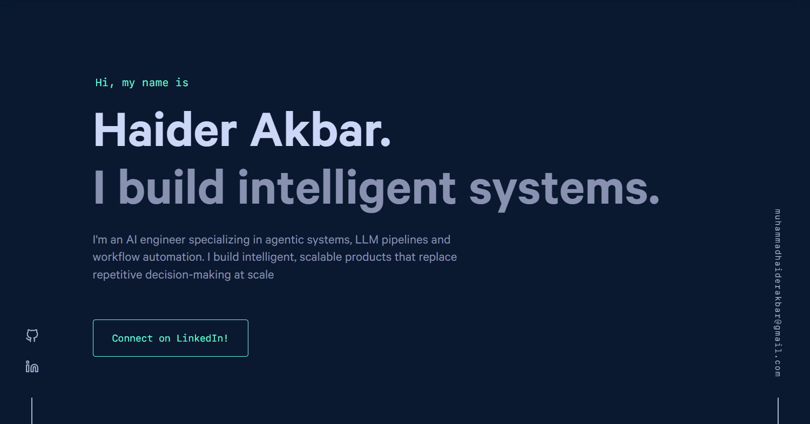

<div align="center">

# haiderakbar.dev

**BUILD ONCE, AUTOMATE FOREVER**

[](https://www.gatsbyjs.com)
[](https://reactjs.org)
[](https://styled-components.com)
[](.nvmrc)
[](https://www.haiderakbar.dev)
[](https://github.com/bchiang7/v4/blob/main/LICENSE)

Personal portfolio of Haider Akbar, an AI engineer specializing in workflow automation, LLM integrations and agentic systems. Statically generated, SEO hardened and crawlable by search engines and LLM scrapers.



</div>

## Getting Started

This project builds only on Node 16 (pinned in `.nvmrc`). Node 17 and newer fail during the webpack stage with `error:0308010C:digital envelope routines::unsupported`.

```bash
nvm use 16
npm install
npm start        # dev server at http://localhost:8000
npm run build    # production build into public/
npm run serve    # serve the build at http://localhost:9000
npm run format   # prettier over the repo
```

## Deploying

Push to `main`. The host rebuilds from source and respects `.nvmrc`. The `public/` folder is a local build artifact and is gitignored, never commit it.

Content-only edits do not need a local toolchain at all: edit the markdown files below directly in the GitHub web editor and commit from the browser.

## Updating Content

All site content lives in the files below. Nothing outside them needs to change for a content update.

| #   | Path                                  | Contents                                                                  |
| --- | ------------------------------------- | ------------------------------------------------------------------------- |
| 1   | `src/components/sections/hero.js`     | Name, tagline, intro paragraph, CTA link                                  |
| 2   | `src/components/sections/about.js`    | About paragraphs and the `skills` array                                   |
| 3   | `src/components/sections/contact.js`  | Closing pitch and contact text                                            |
| 4   | `src/images/me.jpg`                   | Headshot shown in About                                                   |
| 5   | `content/jobs/<Company>/index.md`     | One folder per job: dates, role, bullets                                  |
| 6   | `content/featured/<Project>/index.md` | Featured project cards, each with a `demo.png`                            |
| 7   | `content/projects/*.md`               | Project grid and `/archive/` page, numeric filename prefix controls order |
| 8   | `gatsby-config.js`                    | Site title, meta description shown in Google results, `siteUrl`           |
| 9   | `src/config.js`                       | Email, social links, nav links, GA measurement ID                         |
| 10  | `src/components/head.js`              | JSON-LD schema (job title) and site verification tag                      |
| 11  | `static/resume.pdf`                   | Resume served at `/resume.pdf`                                            |
| 12  | `static/og.png`                       | Social share preview image                                                |
| 13  | `static/llms.txt`                     | Summary for AI crawlers, update manually whenever items 1 to 7 change     |

## Using as a Template

Fork, then replace every file in the table above plus:

- `src/images/logo.png` (favicon and manifest icon)
- `googleAnalyticsID` in `src/config.js`
- `google-site-verification` meta in `src/components/head.js`
- `siteUrl` in `gatsby-config.js`

Core logic (loader, animations, SEO plumbing, page generation) needs no changes.

## Credit

Design based on [Brittany Chiang's v4](https://github.com/bchiang7/v4) (MIT).
